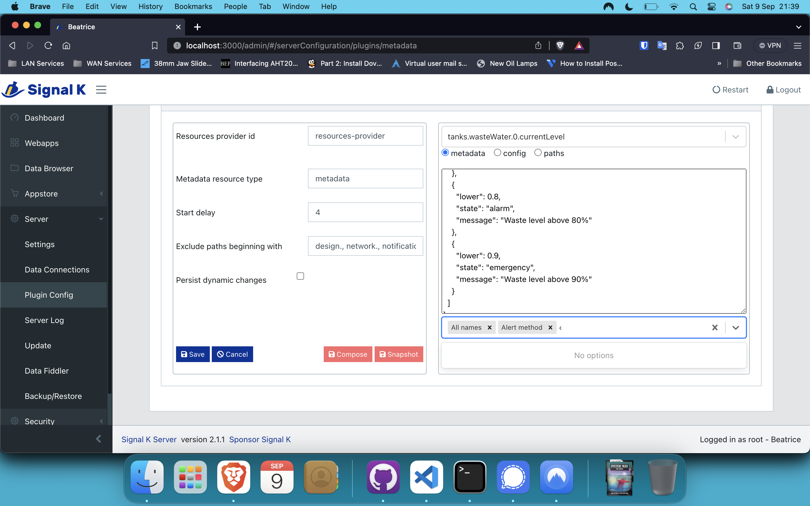

# pdjr-skplugin-metadata

Initialise, maintain and preserve Signal K metadata.



## Description

__pdjr-skplugin-metadata__ implements a resource provider based
intialisation and persistence mechanism for Signal K metadata and
includes a simple editor that can maintain the metadata resources
on which it relies.

The plugin uses the Signal K resource provider as a backing store for
metadata and requires at least one custom resource type (let's call it
the *metadata resource type*) which acts as a repository for metadata
resources.
Each metadata resource has a name equivalent to a Signal K key/path and
a value which specifies the metadata object for this path (the terms
key and path are treated as synonyms in the following discussion).

The Signal K ```resources-provider``` plugin instantiates a resource
type as a file-system folder and each resource as a JSON text file.
With this provider, supplying metadata to initialise a Signal K key
only demands that an appropriately named text file containing the
required metadata is placed in the resource type folder.
Metadata text files can be created and maintained by hand (using an
external text editor or the plugin configuration interface) or
programmatically (using the ```resources-provider`` and/or plugin
interfaces).

When __pdjr-skplugin-metadata__ starts, each metadata resource in the
metadata resource type is loaded into the Signal K data store.
The plugin can be configured to ensure that any subsequent, dynamic,
changes to a 'live' metadata value also update any associated metadata
resource.

The plugin implements two tools, *compose* and *snapshot* that can
help with establishing and maintaining a collection of metadata
resources.

The compose tool is executed from the plugin's configuration panel and
generates metadata resources from one or more *metadata configuration
resource*s through hierarchical composition.
Metadata configuration resources have names of the form '.*path*[.]'.
The compose tool assumes that a metadata resource called '.*path*'
provides metadata destined for the metadata file called *path* whilst
one called '.*path*.' provides metadata for all metadata resources with
names that are hierarchical descendents of *path*.
An example of using metadata configuration files to initialise tank
metadata is included below.

The snapshot tool is also executed from the plugin's configuration
panel and takes a snapshot of metadata for all available Signal K
paths and merges this with any existing resources in the metadata
resource type, creating any metadata resources that do not exist and
updating any that do.
Paths which have no associated metadata are saved with an empty object
as their metadata value.

The plugin exposes an
[HTTP API](https://pdjr-signalk.github.io/pdjr-skplugin-metadata/)
and contributes OpenAPI documentation of this interface to the Signal
K OpenAPI service.

Whilst multiple metadata resource types can be purposed for different
requirements (configuration, snapshotting, prototyping, multi-language
support, whatever), only one resource type can be active at any given
time.

## Example: using metadata configuration files

My ship has five fluid storage tanks: a waste tank, two fresh water
tanks and two fuel tanks.
I want to support a common alarm annunciation strategy across all
tanks, and common, but different, alert zones for each of the
different fluid types.
Each tank has its own unique collection of names.

The initialisation metadata for my five tanks is organised in the
following way.

<table width='100%'>
<tr><th>File name</th><th>File content</th></tr>
<tr>
<td>.tanks.</td>
<td><pre>
{
  "timeout": 60,
  "alertMethod": [ "visual" ],
  "warnMethod": [ "visual" ],
  "alarmMethod": [ "sound", "visual" ],
  "emergencyMethod": [ "sound", "visual" ]
}
</pre></td>
</tr>
<tr>
<td>.tanks.wasteWater.</td>
<td><pre>
{
  "zones": [
    { "lower": 0.5, "state": "alert", "message": "Waste level above 50%" },
    { "lower": 0.7, "state": "warn", "message": "Waste level above 70%" },
    { "lower": 0.8, "state": "alarm", "message": "Waste level above 80%" },
    { "lower": 0.9, "state": "emergency", "message": "Waste level above 90%" }
  ]
}
</pre></td>
</tr>
<tr>
<td>.tanks.fuel.</td>
<td><pre>
{
  "zones": [
    { "upper": 0.15, "state": "alert", "message": "Fuel level below 15%" },
    { "upper": 0.05, "state": "alert", "message": "Fuel level below 5%" }
  ]
}
</pre></td>
</tr>
<tr>
<td>.tanks.freshWater.</td>
<td><pre>
{
  "zones": [
    { "upper": 0.15, "state": "alert", "message": "Fresh water level below 15%" }
  ]
}
</pre></td>
</tr>
<tr>
<td>.tanks.wasteWater.0.currentLevel</td>
<td><pre>
{
  "displayName": "Waste Tank",
  "shortName": "Waste Tank",
  "longName": "Waste Tank (0)"
}

</pre></td>
</tr>
<tr>
<td>.tanks.freshWater.1.currentLevel</td>
<td><pre>
{
  "displayName": "SB Water Tank",
  "shortName": "PS Water Tank",
  "longName": "PS Water Tank (1)"
}
</pre></td>
</tr>
<tr>
<td>.tanks.freshWater.2.currentLevel</td>
<td><pre>
{
  "displayName": "SB Water Tank",
  "shortName": "SB Water Tank",
  "longName": "SB Water Tank (2)"
}
</pre></td>
</tr>
<tr>
<td>.tanks.fuel.3.currentLevel</td>
<td><pre>
{
  "displayName": "SB Fuel Tank",
  "shortName": "SB Fuel Tank",
  "longName": "SB Fuel Tank (3)"
}
</pre></td>
</tr>
<tr>
<td>.tanks.fuel.4.currentLevel</td>
<td><pre>
{
  "displayName": "SB Fuel Tank",
  "shortName": "SB Fuel Tank",
  "longName": "SB Fuel Tank (4)"
}
</pre></td>
</tr>
</table>

## Configuration

The plugin configuration panel implements a graphical user interface
which supports plugin configuration and metadata editing.

The interface presents a left-hand pane which allows changes to be
made to the plugin configuration file and the execution of the
'compose' and 'snapshot' tools.

The right-hand pane is a simple metadata editor.

The plugin configuration itself has the following properties.

<table width="100%">
<tr>
<th>Property&nbsp;name</th>
<th>Property&nbsp;value</th>
<th>Description</th>
</tr>
<tr>
<td>startDelay</td>
<td><pre>4</pre></td>
<td>
Number of seconds to delay plugin start (to allow for resource
provider initialisation).
Optional.
</td>
</tr>
<tr>
<td>resourceType</td>
<td><pre>"metadata"</pre></td>
<td>
Name of the active custom resource type.
Optional.
</td>
</tr>
<tr>
<td>excludePaths</td>
<td><pre>
[
  "design.",
  "network.",
  "notifications.",
  "plugins."
]
</pre></td>
<td>
List of Signal K pathnames or pathname prefixes specifying keys which
should not be processed by the plugin.
Optional.
</td>
</tr>
<tr>
<td>persist</td>
<td><pre>false</pre></td>
<td>
Install a delta input handler to intercept real-time metadata updates
and persist them to the metadata resource type.
The use of this option allows metadata injected into Signal K by a
third-party plugin to persisted in the metadata repository.
Optional.
</td>
</td>
</tr>
</table>

Before the plugin can be used you must configure the Signal K resource
provider so that it supports the metadata custom resource type.

## Operation

The plugin has sensible defaults for all configuration properties and
will start immediately after installation, creating a default plugin
configuration file as it does so.

## Author

Paul Reeve <*preeve_at_pdjr_dot_eu*>
